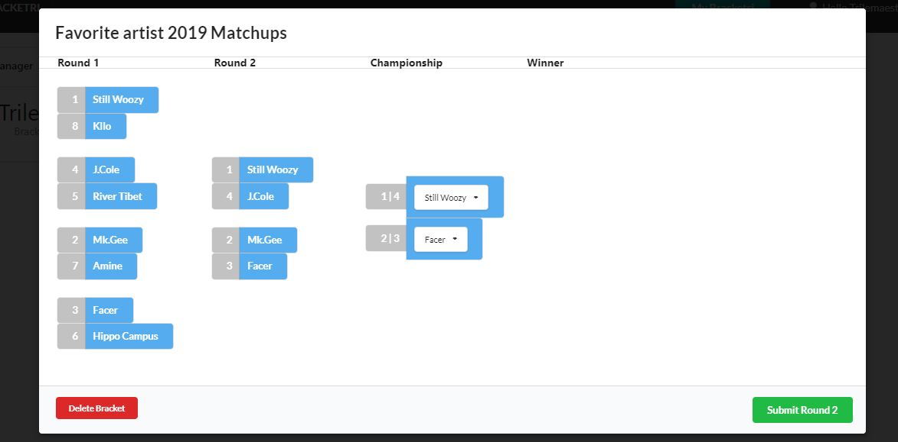

Heroku Link: https://project-bracketri.herokuapp.com/

# Bracketri


This application allow users to create/edit/delete tournaments.(Up to 16)

The front-end uses React, React Semantic.
The back-end uses Node.JS, NPM, MongoDB, Express, and React Passort. 
* React Passport packages: axios, bcryptjs, jsonwebtoken, mongoose, passport, react-router-dom, validator  

* Users can create a profile with user authenication. *Please don't use your actual password*
* Users can create a tournaments with customizeable names .
* Users can advance round by round picking the team to advance.
* Users can delete a tournament.

# how to run the app

You will need to have the following installed run the app:

* Node.js
* Express
* Moment
* Mysql

## Deployment

Clone the repository:

``` bash
$ git clone https://github.com/trilemaestro92/bracketri.git
```
``` bash
$ cd bracketri 
```
``` bash
$ yarn install
```
``` bash
$ cd client && yarn install
```
``` bash
$ cd .. && yarn start
```


